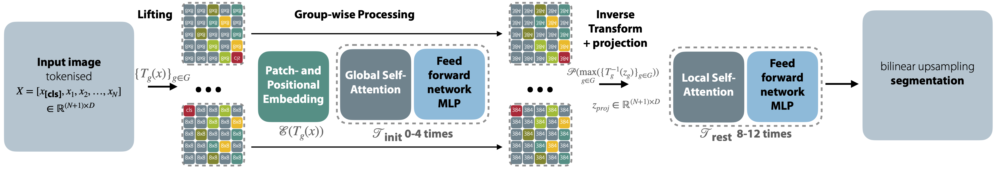
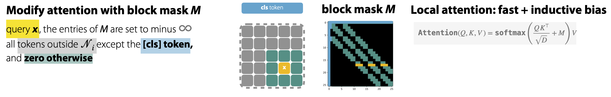

# EquiFlexFormer
MELBA 2025 submission
## Look, No Convs! Equivariance for Vision Transformers in Medical Image Segmentation

### Model Architecture for Equivariant Vision Transformers


### Details of Local Attention implementation with Block Masks


## ✅ Project Checklist

- [x] Initial commit
- [x] Implementation of Flex-Attention
- [x] Implementation of Equivariant Network
- [ ] Comparison with CNNs
- [ ] Upload trained models

## Implementation of Reflection Equivariance
```
class FlipModel4(nn.Module):
    def __init__(self,model1,HW) -> None:
        super().__init__()
        self.model1 = model1
        self.HW = HW
    def forward(self, x,interpolate_pos_encoding=True):
        HW = self.HW
        embed = self.model1.encoder.layer[0](self.model1.embeddings(x,interpolate_pos_encoding=interpolate_pos_encoding))[0]
        for i in range(1,4):
            embed = self.model1.encoder.layer[i](embed)[0]
        for ff in zip([[2],[3],[2,3]],[[1],[2],[1,2]]):
            embed2 = self.model1.encoder.layer[0](self.model1.embeddings(x.flip(ff[0]),interpolate_pos_encoding=interpolate_pos_encoding))[0]
            embed2[:,1:] = embed2[:,1:].unflatten(1,(HW,HW)).flip(ff[1]).flatten(1,2)
            for i in range(1,4):
                embed = self.model1.encoder.layer[i](embed)[0]
            embed = torch.maximum(embed,embed2)
        for i in range(4,len(self.model1.encoder.layer)):
            embed = self.model1.encoder.layer[i](embed)[0]
        y = self.model1.layernorm(embed)[:,1:].permute(0,2,1).unflatten(2,(HW,HW))     
        return y
```


## Abstract 

While medical image segmentation has achieved great success using convolutional neural networks, particularly U-Net architectures, its practical performance and robustness still heavily rely on ad hoc post-processing strategies. Test-time augmentation, for example, is often employed to achieve equivariance to mirrored, rotated, or permuted inputs.

In contrast, vision transformers could, in principle, be less susceptible to such issues, as the self-attention mechanism is inherently equivariant to permutations of the input. However, their practical performance in medical image segmentation remains limited, primarily due to their need for large amounts of training data, given the absence of the inductive biases found in CNNs. Additionally, operations like patch embedding and positional encoding break the permutation equivariance of vision transformers, and large patch sizes tend to degrade segmentation quality.

In this work, we propose a new approach that enables equivariance to geometric transformations, such as reflections, in the early layers of a vision transformer while preserving strong model performance. By employing robust self-supervised pretraining and small patch sizes, we achieve state-of-the-art performance on several 2D segmentation benchmarks. Our method outperforms ResNet models pretrained with supervision and certain types of equivariant U-Nets, and performs comparably to more complex variants with test-time augmentation.

Our code is available at https://github.com/mattiaspaul/EquiFlexFormer.


